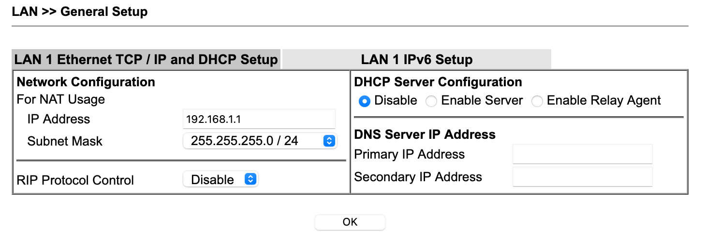

# XS4ALL Internet & IPTV over VDSL2 using a DrayTek modem with pass-through PPPoE / VLAN 4 and VLAN 6

### Introduction

This guide outlines an installation that supports XS4ALL IP and IPTV through a DrayTek modem.

### Setup

Internet ↔ DrayTek [P1] ↔ router with PPPoE capabilities ↔ VLAN-enabled switch ↔ home network.

Internet through XS4ALL; [DrayTek Vigor2765 Annex A](https://www.routershop.nl/draytek-vigor-2765-annex-a-adsl2-en-vdsl2-router/pid=63348); router can be anything that supports PPPoE with VLAN, I have a [Meraki MX65](https://documentation.meraki.com/MX/MX_Overviews_and_Specifications/MX64_and_MX65_Overview_and_Specifications); I use a [NETGEAR GS105Ev2](https://www.netgear.com/support/product/GS105Ev2.aspx) to support VLAN tagging. On the home network I have two XS4ALL TV boxes (one Arris VIP 2952, one Motorola VIP 1853).

At the time of this writing (Jan, 2021), XSALL requires IP traffic to go over VLAN 6 and IPTV traffic over VLAN 4.

### Start simple

Connect the PPPoE client to port 1 (P1) on the DrayTek. (Note that the above network diagram has the PPPoE client send its PPPoE traffic through a switch (in via port 2, out via port 1 on the NETGEAR switch). However, when you start, you should connect the PPPoE client directly into P1 on the DrayTek. Only when _that_ works should you consider making the setup more complex.) 

### DrayTek WLAN1 setup

Connect DSL line, connect computer via Ethernet to port P4, manually configure computer to 192.168.1.100, browse to [http://192.168.1.1](http://192.168.1.1), log in.

Go to WAN → Internet Access → General Setup → <ins>WAN1</ins>, Enable, Display Name "XS4ALL", DSL Mode "Auto", VLAN Tag Insertion → Customer Tag → VDSL2 → Enable, but leave Tag value unset (that is, zero). This last step ensures that the DrayTek passes through the PPPoE VLAN tag. (This is explained in a [DrayTek KB Article](https://www.draytek.com/support/knowledge-base/5367).)

### DrayTek Internet Access setup

Go WAN → Internet Access → click WAN1's "Details Page" button.

Under the "PPPoE / PPPoA" tab, set Disable.

Under the "MPoA / Static or Dynamic IP" tab, set Enable. (ADSL settings are irrelevant, but they are set to Channel 2, 1483 Bridged IP LLC, VPI 8, VCI 71, Modulation Multimode.) Set "Obtain an IP Address Automatically", set MTU to 1492, and check the "Enable Full Bridge Mode", and set Bridge Subnet to LAN1. (Make sure the router is plugged in to DrayTek port P1.)

### Disable DHCP on DrayTek

Presumably, some other device on your network will run a DHCP server. Navigate to LAN → General Setup, click on LAN1's "Details Page" button. Ensure "DHCP Server Configuration" is set to Disable.

### DrayTek Online Status

Once DrayTek reboots and connects, the internet LED will remain orange. The on/off LED will blink green.

Log in, navigate to Online Status → Physical Connection. It should look like this. Notice that WAN1 remains red, because the router is establishing the internet connection, not the DrayTek.

### Configuring PPPoE with VLAN 6 on your router

Your PPPoE client needs to connect with VLAN tagging (ID 6) and dummy authentication data. I have a [Meraki MX65](https://documentation.meraki.com/MX/MX_Overviews_and_Specifications/MX64_and_MX65_Overview_and_Specifications); its PPPoE configuration looks as follows.

### Supporting IPTV over VLAN 6

XS4ALL TV boxes (e.g., Arris VIP 2952 or Motorola VIP 1853) cannot apply VLAN tags on their own. They will need to connect to a network port that applies the VLAN tag with ID 6 for them—for example, a [NETGEAR GS105Ev2](https://www.netgear.com/support/product/GS105Ev2.aspx).

You will need to install the [ProSAFE Plus Configuration Utility](https://www.netgear.com/support/product/GS105Ev2.aspx#download) (Windows only, but it works in VMWare using bridged networking; note that depending on network configuration, you may need to turn off the network interface on the host first before the guest can connect). Give ProSAFE Plus Configuration Utility access to private networks if Windows asks for it. Select the switch, the default password is `password`.

**Please note: this is the configuration for the network diagram at the top of this page. These instructions are for the NETGEAR GS105Ev2 are added here only for illustrative purposes. The summary is that all IPTV traffic needs to be tagged with VLAN 4.**

These instructions refer to a "Meraki MX65" or "MX65": that is the "Router & PPPoE client" in the network diagram.

Under the "VLAN" tab, select the "802.1Q" sub-tab, select Advanced, and enable Advanced 802.1Q. Confirm the warning that this will wipe existing configuration.

Under "VLAN configuration" add VLAN 4 and VLAN 6. There are now three VLAN IDs: 1, 4, and 6.

Configure "VLAN Membership". When either a port is labelled T (tag) or U (untag), it **is** part of the VLAN. When the port is unlabeled, it is **not** part of the VLAN: the switch will send no packets to that port, be it tagged or untagged. Only devices that know how to deal with VLAN tags (i.e., other routers or switches, or explicitly capable devices) can get tagged traffic. Regular client devices get untagged traffic.

- VLAN 1 is the regular, default LAN and is not aware of VLAN. Ports 3 and 5 are "regular" switch ports that are part of the regular LAN and everything needs to be untagged. So:
  - unchecked: 1, 2, 4 (not part of VLAN, don't send LAN traffic on these ports)
  - untag: 3, 5 (there are VLAN-unaware devices on these ports)

- VLAN 4 is TV traffic. The Arris VIP 2952 (plugged into port 4) is VLAN-**un**aware, but XS4ALL needs to see all its traffic as sitting on VLAN 4. The Arris does a DHCP request and that traffic needs to go to the MX65 via port 5. In other words, ports 1, 4, and 5 are part of VLAN 4, but only port 1 (to XS4ALL) can see the VLAN 4 tag.
  - unchecked: 2, 3 (they stay out of this)
  - tag: 1 (only XS4ALL sees the VLAN 4 tag)
  - untag: 4, 5 (part of VLAN 4, but can't handle the VLAN tag)

- VLAN 6 is Internet traffic. The Meraki MX65 (plugged into port 2) does its PPPoE thing over this. The MX65 already tags traffic as VLAN 6, but it won't hurt to mark it as a tag-port. The switch is smart enough not to double-tag. So:
  - unchecked: 3, 4, 5 (these ports are unrelated, not part of the VLAN)
  - tag: 1, 2 (both the Meraki MX65 Internet 1 port and XS4ALL can deal with VLAN tags)

Under "Port PVID" (unsure this configuration matters all that much, but this works):

1. 6 (Internet traffic between MX65, Internet 1 port and Draytek Vigor 2765)
2. 6 (same)
3. 1 (regular LAN)
4. 4 (TV traffic)
5. 1 (regular LAN, to one of MX65's LAN ports)

### Related information

* [Use Vigor130 as a Bridge](https://www.draytek.com/support/knowledge-base/5367), DrayTek KB Article, explains VLAN pass-through.
* [PPPoE Pass-Through Setup](https://www.draytek.com/support/knowledge-base/4910), DrayTek KB Article, though not with VLAN pass-through.
* [Instellingen voor andere modems](https://www.xs4all.nl/service/installeren/internet/instellingen-andere-modems/), XS4ALL information about modem settings, in Dutch 🇳🇱.
* [Eigen router achter een XS4ALL-VDSL-aansluiting (4)](https://www.haroldschoemaker.nl/2017/02/eigen-router-achter-een-xs4all-vdsl-aansluiting-4/), in Dutch 🇳🇱.
* [XS4ALL met eigen modem/router](https://xs4all.gebruikers.eu/forum/viewforum.php?forum_id=16), discussion forum, in Dutch 🇳🇱.
* [Forum discussion about XS4ALL DSL](https://xs4all.adsl.narkive.com/mvDJ31yK/hik-dsl-blijft-prima-up-maar-ppp-sessie-weg), in Dutch 🇳🇱.
